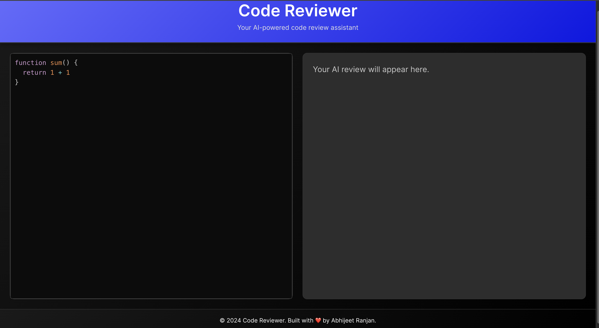
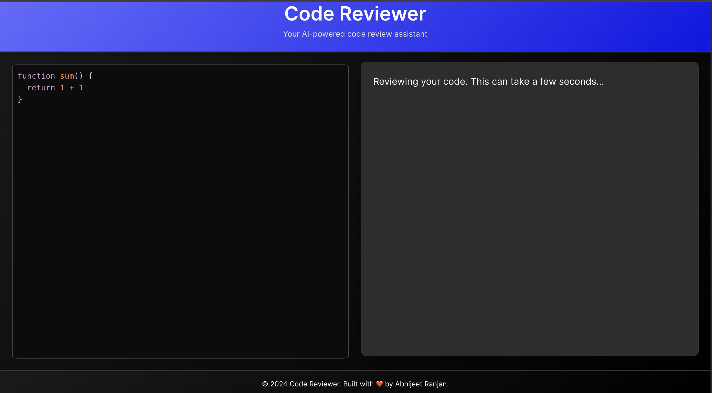
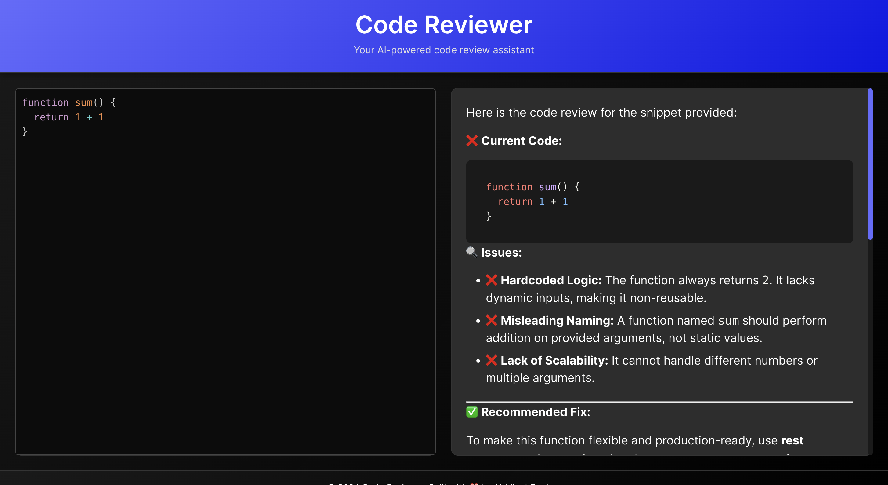

# Code Reviewer

Code Reviewer is a full-stack AI code review app. Paste JavaScript code into the editor, submit it for review, and get structured feedback about bugs, readability, performance, security, and maintainability.

## Live Demo

[Open Code Reviewer](https://code-review-gamma-rouge.vercel.app/)

## Screenshots

Empty review panel:



Review loading state:



Generated review result:



## Features

- Interactive code editor with syntax highlighting
- AI-generated code review feedback
- Markdown-formatted review output
- Copy-code action
- Loading state while the AI response is generated
- Separate React frontend and Express backend

## Tech Stack

Frontend:

- React
- Vite
- Axios
- PrismJS
- React Markdown
- React Icons

Backend:

- Node.js
- Express
- Google Gemini API
- dotenv
- CORS

## Project Structure

```text
CodeReview/
  BackEnd/
    src/
      controllers/
      routes/
      services/
    server.js
    package.json
  Frontend/
    src/
      App.jsx
      App.css
      main.jsx
    package.json
    vite.config.js
```

## Getting Started

Clone the repository:

```bash
git clone https://github.com/ranjanabhijeet/CodeReview.git
cd CodeReview
```

Install backend dependencies:

```bash
cd BackEnd
npm install
```

Create a backend environment file:

```text
GOOGLE_GEMINI_KEY=your_gemini_api_key
GEMINI_MODEL=gemini-3.6-flash
PORT=3000
```

Start the backend:

```bash
npm start
```

In another terminal, install frontend dependencies:

```bash
cd Frontend
npm install
```

Start the frontend:

```bash
npm run dev
```

Open the app:

```text
http://127.0.0.1:5173/
```

## Environment Variables

Backend:

```text
GOOGLE_GEMINI_KEY=your_gemini_api_key
GEMINI_MODEL=gemini-3.6-flash
PORT=3000
```

Frontend:

```text
VITE_API_BASE_URL=http://localhost:3000
```

For production, set `VITE_API_BASE_URL` to the deployed backend URL.

## API Endpoint

Generate a code review:

```text
POST /ai/get-review
```

Request body:

```json
{
  "code": "function sum() { return 1 + 1 }"
}
```

## Deployment

The frontend can be deployed on Vercel. The backend should be deployed separately on a Node.js hosting service such as Render, Railway, or another server platform.

After deploying the backend, add the backend URL to the frontend environment variables:

```text
VITE_API_BASE_URL=https://your-backend-url
```

## Notes

- AI responses can take a few seconds because the backend waits for Gemini to generate the review.
- Keep API keys out of public commits.
- Do not commit `node_modules`; dependencies should be installed with `npm install`.
